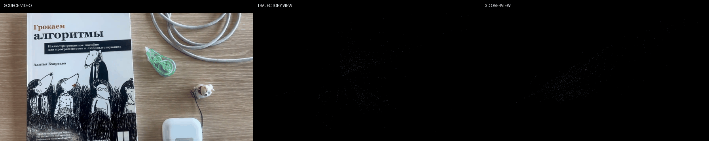
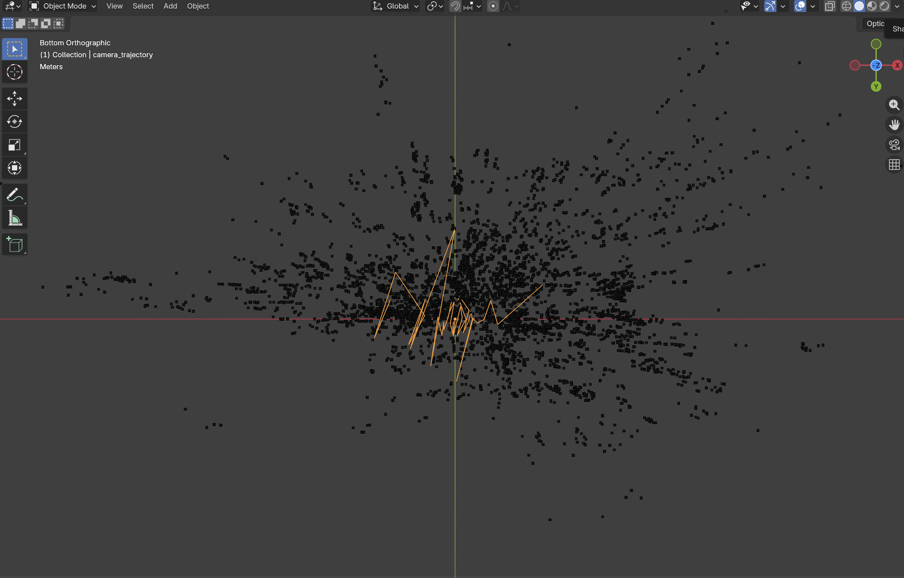
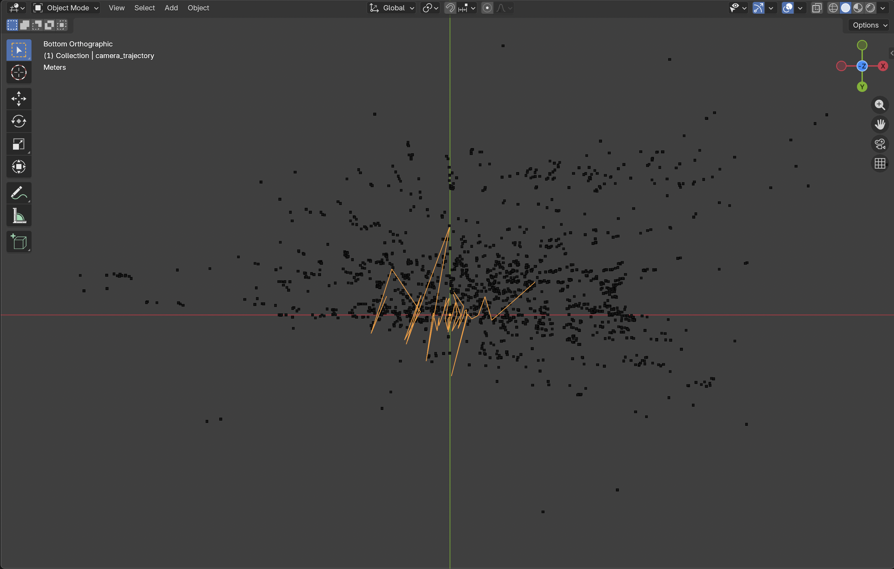

# Avatar Playground

A modular C++ computer vision playground for developing and evaluating real-time perception modules for intelligent avatars, spatial computing, and XR applications.

Avatar Playground is designed as a unified framework for implementing, visualizing, and comparing both classical and learning-based perception algorithms. Starting from low-level image processing, the project progressively expands toward feature tracking, pose estimation, visual odometry, sensor fusion, and neural avatar technologies, with each module designed to integrate into a single real-time perception pipeline.

The long-term objective is to bridge computer vision, computer graphics, machine learning, and XR in an extensible environment for rapid experimentation with next-generation avatar systems.

---


# Project Status

## Phase 1 — Spatial Geometry: Complete

Implemented a modular monocular visual-geometry pipeline covering
feature tracking, relative camera motion estimation, sparse 3D
reconstruction, persistent landmark management, and camera
localization.

The reconstructed sparse map and camera trajectory can be exported
to PLY and inspected in Blender. 
(Updated) The system also provides an interactive 3D visualization 
using OpenCV Viz and records numerical camera trajectories for 
later evaluation.

### Motion Estimation

- Essential Matrix Estimation
- RANSAC-based Outlier Rejection
- Relative Camera Pose Recovery
- Monocular Visual Odometry
- TUM RGB-D validation

### 3D Reconstruction

- Feature-based Triangulation
- Sparse 3D Map
- Persistent Landmark Association
- Reprojection Error Validation
- PnP + RANSAC Camera Localization
- Camera Trajectory Estimation
- PLY Map Export
- Blender-based 3D Visualization
- Real-time 3D spatial visualization
- Camera trajectory logging

### Current Limitations

- Monocular translation has inherent scale ambiguity.
- Visual odometry currently assumes a predominantly static scene.
- Dynamic objects can produce incorrect camera-motion estimates.
- The current system does not yet perform global optimization or
  loop closure.

These limitations are intentionally preserved as part of the
current experimental baseline and will be addressed in later
spatial-understanding stages.

## Phase 2 — Human Reconstruction: In Progress

The next stage focuses on learning-based human mesh recovery using
the ANNY parametric human body model.

---

## Results

### Spatial Mapping Demo



Monocular visual odometry reconstructs a sparse 3D scene while estimating
the camera trajectory from prerecorded video.

### Sparse 3D Reconstruction



Sparse 3D landmarks reconstructed from monocular video and exported
to PLY for inspection in Blender.

### Persistent Landmark Map



Landmarks observed across multiple frames are retained as persistent
spatial structure.

---
# Architecture

```
Camera
   │
   ▼
ProcessorManager
   │
   ├── Image Processing
   │    ├── GrayProcessor
   │    ├── BlurProcessor
   │    ├── ThresholdProcessor
   │    └── CannyProcessor
   │
   ├── Feature Processing
   │    ├── HarrisProcessor
   │    ├── ShiTomasiProcessor
   │    ├── ORBProcessor
   │    └── OpticalFlowProcessor
   │
   ├── Feature Matching
   │    ├── BFMatcherProcessor
   │    └── KNNMatcherProcessor
   │
   └── Geometry
        ├── RANSACProcessor
        ├── MotionEstimationProcessor
        ├── TriangulationProcessor
        └── PnPProcessor

              │
              ▼
           Map3D
              │
              ├── Persistent Landmarks
              └── Camera Trajectory
                       │
              ┌────────┴────────┐
              ▼                 ▼
         PLY Export       SpatialVisualizer
                              │
                              ▼
                         OpenCV Viz
```
`SpatialVisualizer` provides real-time visualization of the sparse
map, camera trajectory, current camera pose, and coordinate system
without coupling visualization logic to the perception processors.

Each perception module implements a common processor interface, allowing algorithms to be developed, evaluated, and replaced independently.

The architecture separates acquisition, processing, visualization, and configuration, making the framework suitable for iterative experimentation and future integration of learning-based methods.

Stateful modules (such as optical flow and feature matching) maintain persistent state through `ProcessorManager`, enabling temporal algorithms to operate consistently across consecutive frames.

---

## Roadmap

### Phase 1 — Spatial Geometry
- [x] Camera capture
- [x] OpenCV fundamentals
- [x] Feature detection and matching
- [x] Essential matrix + RANSAC
- [x] Visual Odometry
- [x] Triangulation
- [x] Sparse 3D mapping
- [x] PnP localization
- [x] Persistent landmarks
- [x] Camera trajectory
- [x] PLY map export
- [x] Blender visualization
- [x] Real-time 3D spatial visualization
- [x] TUM RGB-D validation
- [x] Experiment logging
- [x] Numerical trajectory export

### Phase 2 — Human Reconstruction
- [ ] Understand ANNY parameterization
- [ ] Integrate ANNY parametric body model
- [ ] Generate and visualize ANNY meshes
- [ ] Establish image-to-ANNY fitting baseline
- [ ] Investigate Multi-HMR as an initialization method
- [ ] Implement PyTorch HMR baseline
- [ ] Regress pose and phenotype parameters
- [ ] Add differentiable projection/rendering
- [ ] Add 2D keypoint and silhouette supervision
- [ ] Evaluate reconstruction on real images

### Phase 3 — Spatial Avatar
- [ ] Connect HMR with camera geometry
- [ ] Recover human in world coordinates
- [ ] Temporal human tracking
- [ ] Unity avatar integration
- [ ] Real-time spatial avatar prototype

---

# Technologies

- C++17
- OpenCV 4.x
- OpenCV Viz
- CMake
- Visual Studio Code
- Blender

Future integrations may include:

- PyTorch
- ONNX Runtime
- MediaPipe
- Unity
- CUDA

---

# Building

```bash
mkdir build
cd build
cmake ..
cmake --build .
```

Run the main application:

```bash
./AvatarPlayground
```

Run the spatial mapping demo after placing an .mp4 video in assets/demo/:

```bash
./SpatialDemo
```

Generate the demo GIF:

```bash
python3 tools/convert2gif.py
```

Run tests:

```bash
./PnPTest
./TUMTest
```

---

# Project Structure

```
include/
│
├── processors/
├── visualization/
│   └── SpatialVisualizer.h
├── Map3D.h
├── MapPoint.h
├── VisualOdometry.h
├── Config.h
├── ProcessorManager.h

src/
├── processors/
├── visualization/
│   └── SpatialVisualizer.cpp
├── Map3D.cpp
├── VisualOdometry.cpp
├── ProcessorManager.cpp
├── HUD.cpp
├── Input.cpp
├── Timing.cpp
├── main.cpp
└── tests/

datasets/
└── tum/

assets/
docs/
└── papers/

tools/
└── convert2gif.py

logs/
```

---

# Design Principles

The framework is designed around several core principles:

- **Modularity** — each algorithm exists as an independent processor.
- **Comparability** — different methods can be evaluated under a common interface.
- **Real-Time Performance** — interactive visualization and low-latency processing.
- **Extensibility** — new perception modules can be integrated without modifying the existing pipeline.
- **Research-Oriented Development** — classical computer vision and modern deep learning methods coexist within the same architecture.

---

# Long-Term Vision

Avatar Playground is intended to evolve into a unified perception framework for intelligent avatars.

Rather than existing as a collection of isolated computer vision demos, the framework serves as an experimental environment where perception, geometry, machine learning, and graphics modules can be combined into complete real-time avatar systems.

Future work will progressively integrate neural reconstruction, generative models, and spatial computing techniques, enabling rapid experimentation with next-generation digital human technologies.
