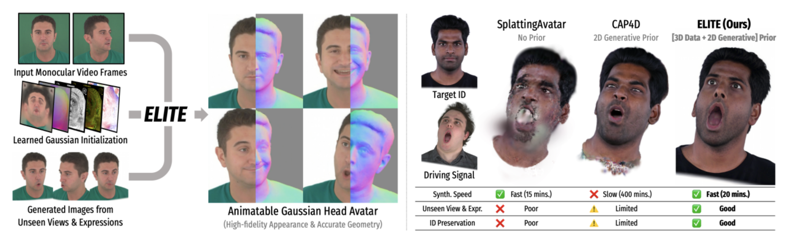

# ELITE: Efficient Gaussian Head Avatar from a Monocular Video via Learned Initialization andTEst-time Generative Adaptation

Comment: Gaussian avatars with identity preservation
Github: https://github.com/kaist-ami/elite
Project page: https://kim-youwang.github.io/elite

*Research quesiton*: existing methods lean on either a 3D data prior (generalizes poorly in-the-wild) or a 2D generative prior (diffusion models - slow, identity-hallucinating). 

*Proposed solution*: ELITE combines both(3D data prior and 2D generative prior) in a way each compensates for the other's weakness:

- **3D prior**:  feed forward Gausssian head initialization.
- **2D generative prior:** augmenting unseen views and expressions for test-time adaptation.

*Results*: beats FlashAvatar, SplattingAvatar, CAP4D, SynShot on PSNR/LPIPS/CSIM (identity similarity) while being ~60× faster in image generation speed than full-diffusion 2D-prior methods and producing full torso/shoulder geometry, which prior methods skip.

## Core ideas:

1. **3DGS doesn't have normals**, since each Gaussian is a blob with position, color, opacity, and 3D covariance (a shape-and-orientation matrix (3×3) that encodes how stretched the blob is along each axis, and which way those axes point). As a result, each blob has no information about "this is the surface, this is the outward direction." What this means: along any camera ray, several overlapping blobs can explain the same pixel color with very different underlying geometry → struggles with depth reconstruction. **2D Gaussian flattens each individual blob's third axis to ~0**, turning it into a disk with one well-defined normal - the direction of the flattened axis.

*In ELITE, to make use of FLAME's UV textures, the authors use 2D Gaussians.

2. _Question_: Why ELITE wants to use **FLAME's UV**?

   _Answer_: In order to unlock **shared coordinate system**.

   > 💡 Each texel (u,v) means "the same anatomical spot on the face" whether it's frame 1 or frame 500, so temporal and cross-identity supervision just works.
   > Example: texel (u,v) = "tip of nose" regardless of identity or timestamp.
    
3. Another reason to link to FLAME is to **enable animatiable surface**. Logic: animate FLAME → move the corresponding 2D Gaussians accordingly. 
4. MGPM is feed-forward U-net shape. 
    
    *Question*: Why use **U-net architecture**? 
    
    *Answer*: Thanks to **skip connections** U net helps to **learn the fine details**. 
    
    > 💡 The **bottleneck** (bottom of the U) is great at capturing ***global context*** ("this whole region is a nose," "this is a smiling expression") but it's thrown away almost all spatial precision to get there. If you only upsample from the bottleneck, you get correct semantics but blurry, misaligned edges - like reconstructing a photo from a tiny thumbnail. **Skip connections** hand the decoder the original **high-resolution detail** (edges, textures, fine structure) directly, so the output can be both semantically correct *and* pixel-precise.
    
    For MGPM specifically, this fits the task well: it needs global understanding (identity, expression - "what face is this") *and* pixel-precise output (every UV texel needs an accurate Gaussian, or you get seams/blur on the avatar). A plain bottleneck-only CNN would blur those fine per-texel details; the skip connections are what let MGPM output sharp, spatially-aligned Gaussian parameters while still reasoning globally about the face.
    
5. *Problem***: 3D data priors trained on multi-view capture don't generalize to selfie video.** 
    
    *What it means:* **Studio capture** gives ***simultaneous* multi-view frames** (many angles of the exact same expression at the exact same instant), while a **monocular selfie video** only ever has **one angle at a time, with pose/expression drifting between frames**. 
    So the network trained expecting "many synchronized viewpoints per moment" now sees "one viewpoint, moments spread across time”.
    
    
    > 💡 *Question*: how are the real selfie frames obtained? didnt they use the dataset with the stuido capture?
    > *Answer*: Two separate datasets, used at two separate stages. 
    >
    >- **Training MGPM** (the general-purpose prior): NerSemble-V2, a studio multi-view capture dataset.
    >
    >Network learns "what faces generally look like across identities/expressions/viewpoints." This happens once, offline, before any test subject is involved.
    >- **Test-time adaptation** (Nreal=3 real frames): these come from the *actual input video you're trying to build an avatar for.* In ELITE they pull test videos from INSTA, a dataset of in-the-wild monocular face videos.
    
    
    *Solution*: *fine-tune* MGPM's weights on the **real selfie frames** from the input video (Nreal=3 of them, sampled from that video).
    
6. *Problem*: Prior full-diffusion methods (CAP4D/GAF) generation of **missing view or expression** was made **from pure noise** to match the target image (i.e. starting from 0%) → slow.
    
    *Solution*: ELITE instead **renders the avatar itself** (already fit from stage 1, since that avatar was only trained on **~3 real frames**, rendering it at an unseen angle naturally comes out blurry/artifacted) at the new pose/expression and use ***single-step* diffusion enhancer** (fine-tuned SD-Turbo) to add details based on reference image. That blurry render is the **~80% starting point**. →  faster output.
    
7. *Problem*: Cannot generate avatar in the **new unseen epxressions/poses outside of training frames**.
    
    *Solution*: Use **3D Gaussian avatar** (from stage 1) and pick **random expression/pose** (`Θrand` - FLAME parameters they choose, e.g. a specific jaw angle or gaze direction) and ***render* that avatar** from that new angle via normal rasterization, then run the **diffusion enhancer** on the resulting render. After generating these synthetic novel-pose images, they're **fed back in as *additional training supervision*** to fine-tune the avatar prior again .
    
    Render + Enhance → Use as new supervision → The avatar gets better at those poses
    
    > The render image obtained thanks to the **2D Gaussian that MGPM predicts**, that gives us ***textures*** (skin tone, freckles, hair).
    >
    >**FLAME** serves as a ***driving skeleton*** (its new pose/expression tells the Gaussians where to move).
