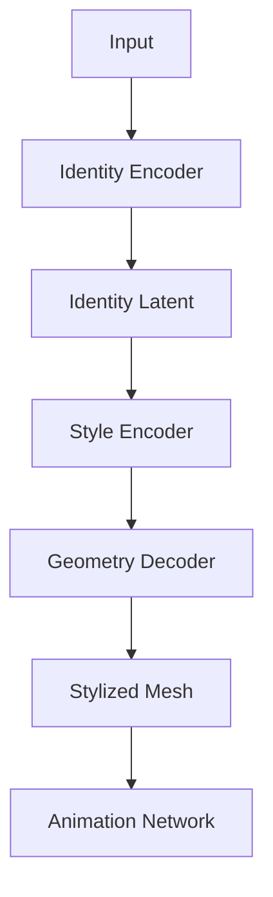

# LeGO: Leveraging a Surface Deformation Network for Animatable Stylized Face Generation with One Example

Full Paper: https://arxiv.org/pdf/2403.15227

# Summary

> 💡 **Goal:** create a stylized 3D face meshes that satisfy 3 main properties:
>
> 1. Avatar in desired CG-friendly topology
> 2. Stylization beyond 3DMM (FLAME)
> 3. Animatable

#### Approach:

1. First training the **surface deformation network** with the **FLAME decoder** to leverage its linear shape space combined with global expression space.
2. At fine-tuning stage, employ a **directional CLIP-based** domain adaptation
method(widely used in 2D domain), to retain the face identity while reflecting the desired style.
    
    > Q: How 2D based method was adapted to 3D domain?
    > 
    > 
    > A: Introduce **hierarchical rendering scheme** that captures local and global facial features, ensuring effective training and identity preservation.
    > 
3. Inference stage: **Mesh Agnostic Encoder (MAGE)** to enable mesh agnostic stylization for an input, which we call a **deformation target** that has various mesh topologies. 
In other words: extract the identity and expression information from an input mesh of *any topology* so that your stylized 3D model can "wear" the deformation features of that input. 
***Result***: The ***output mesh will always have the topology of your chosen template,*** but it will exhibit the ***identity and facial expressions*** found in your ***input "deformation target."***

*MAGE composition:* 
Pre-trained encoders from Neural Face Rigging(NFR) + Latent mapping networks (encoding mesh representations into a topology-invariant latent space).

### Related work

#### **1. Stylized 3D face generation:**

*What is used:* **2D methods** for **capturing identity features** and apply stylization 

*Where it fails:* **Cannot** generate a mesh in **desired topology**

---

*What is used:* **3DMM-based personalized 3D face** generation methods with text-guidance for producing **high-fidelity stylized textures** for 3D face.

*Where it fails:* **limited to 3DMM shape space** → no geometric exaggerations or abstraction beyond the training data

#### **2. Learning-Based 3D Shape Network:**

*What is used:* Learning **implicit functions for 3D shapes** to represent complex geometric structure. 

Example 1: **DIF-Net:** MLPs for SDF and volumetric deformation function → comprehensive mapping between the produced SDF.

Example 2: **DD3C**: template deformation for 3D caricature auto-decoder. Core finding: *modeling each shape as a deformation of a fixed template* surface is more effective compared to predicting absolute position. 

> 💡 What it means: instead of predicting raw (x,y,z) coordinates of every vertex on a face → only learn the “delta” - displacement from a known 3DMM template, i.e. FLAME

*Where it fails:* **Unable to create highly stylized representations.**

> 💡 (!) A **3DMM** like FLAME isn't just a static shape; it is a **mathematical function that defines how a face moves**. It uses two specific sets of parameters:
>
> - **Shape parameters (β)**: Determine the identity (e.g., jaw width, nose length).
> - **Expression parameters (ψ)**: Determine how the face deforms during movement (e.g., smiling, blinking, talking).

*→ Proposed solution:* Train a surface **deformation network(Ds)** on 3DMM and transfer its domain into stylization → inherit the "animation intelligence" of the model.

> Because the network Ds is trained on FLAME, it learns that a specific set of expression parameters ψ must correspond to specific vertex movements. By training the network to reconstruct the output of the FLAME decoder, the network essentially "memorizes" the **geometric rules of how a human face articulates**.
> 

*Result*: This allows the model to **retain the ability to perform facial animations** (since it is still grounded in 3DMM structures) while **achieving high-level stylization** that goes far beyond the original, photorealistic training data.

---

*What is used:* Transfer shape deformations using **support from examples or text**. 

*Where it fails:* Not effective when comes to coherent control of animaiton, in other words: **fail to preserve the "rigging"** or "animatability" of the original mesh.

> 💡 Why that happens:
>
> 1. **The Conflict Between Geometry and Motion:** Traditional deformation methods often treat the 3D mesh as a static geometric surface. When you apply a drastic stylistic transformation (e.g., exaggerating the nose or cheeks to look like a caricature), you often break the underlying vertex correspondences or bone weights that define how the face moves.
> 2. **Decoupling Animation from Shape:** In standard 3D face pipelines, facial motion is driven by blend shapes (pre-defined static facial expressions). If a deformation method forces the mesh into a new, stylized shape, the original blend shapes no longer "fit" the new geometry. This leads to artifacts, such as *mesh collapsing* or *unnatural tearing* during animation.

#### 3. Few-Shot Domain Adaptation

*Background limitation*: 

1. Traditional 3D Morphable Models (3DMM) are highly effective for animation, but limited on **geometric exaggerations** or artistic **"non-photorealistic" stylizations**, as the geometry is locked within the distribution of the training data. 
2. Existing stylization methods produce **surface artifacts** or lose the underlying rig structure → **fail to** **preserve animatable properties**.  

*What is used:* Domain adoptatin is utilization of neural networks that were **trained on a large dataset** and then **fine-tuned to a smaller dataset** from a target domain. Widely used in 2D domain, but also was adapted to vision-language networks **CLIP** for distinguishing between identity and style. 

*Why*:  Bridge the gap between a pre-trained model (which knows how to create standard 3D faces) and a target style (provided via a 2D image or exemplar) to achieve high-quality Stylization. → To **use 2D image as a style reference** while **preserving the underlying rigging functionality.**

*Application in LEGO*: use **two-way direction guidance of** **CLIP and combine with a** **differentiable renderer** to "see" how a 3D mesh looks in 2D space and adjust its shape to match a target style while **keeping its identity** intact using **paired exemplar**.

> 💡 Breakdown of how this two-way directional guidance works:
>
> 1. **Semantic Guidance via CLIP**: CLIP is trained on massive datasets of image-text pairs, giving it an intuitive understanding of both facial identities and artistic styles (e.g., "cartoon," "sculpture," "oil painting"). By using CLIP, the system can determine in which **"direction" in the latent space** the mesh needs to move to transition from a realistic face to the desired stylized version.
> 2. **Differentiable Rendering:** To perform optimization on 3D meshes using CLIP (which operates on 2D images), the system uses a differentiable renderer. This allows the model to **project the 3D mesh into 2D views**, calculate the loss based on the CLIP embedding, and, critically, backpropagate that error signal to update the actual 3D vertex positions of the mesh.
> 3. **Identity Preservation:** The "two-way" nature is essential. It ensures that while the mesh *takes on the style* of the target exemplar, it ***does not lose the unique facial features*** (the identity) of the original input. This is done by comparing the CLIP embeddings of the source and stylized images and ensuring the relative "distance" between different identities remains consistent across domains.
> 4. **Paired Exemplar:** The system uses a specific pair consisting of an identity exemplar mesh(Ms) and a stylized exemplar(Mt). This **pair acts as the** **ground truth guidance**, ensuring the network learns the specific transformation required **to reach the target style** without deviating into unwanted geometries.

*Core insight:* How can we make a use of "frozen" 2D models (like CLIP) to steer the training of 3D models.

#### 4. Mesh Agnostic Deformation (Encoder)

*Background Limitation*: Standard **3D models(3DMMs) often rely on a *fixed template with consistent vertex ordering to function.***  (like a specific 3D Morphable Models (3DMM)). If you try to feed a mesh with a different number of vertices or a unique connectivity structure into a standard network, it will fail.

*What*: **Mesh agnostic networks** shown a great performance for l**earning 3D shape representations without relying on the consistent topology or vertex ordering**.

> 💡 **Mesh agnostic networks -** artificial intelligence and geometric computing models that can process 3D spatial data, fluid dynamics, or structural physics regardless of the underlying mesh structure, density, or resolution

- **NFR** - autoencoder for facial expression retargeting that is using **separate encoders** for **identity** and **expressions**.

*Why*: Create topology-invariant latent space by using 2 pretrained encoders of NFR → **Independance from vertex ordering** and enable **any topology as input**.  

*Application in LeGO:* map NFR’s embeddings(pre-trained encoder’s output) into LeGO’s latent space(surface deformation network). → **Encode geometric shape** of deformation target and feed into deformation network. 

#### Summary:

| Existing solution | Limitations | Proposed Solution | Result |
| --- | --- | --- | --- |
| Implicit Functions (e.g., DeepSDF) | Great for complex geometry, but **hard to animate**/rig via blend shapes. | **Surface Deformation Network Ds** with 3DMM | Combines implicit-like **deformation** with explicit 3DMM **animation** control. |
| 3DMM based Generation (Standard) | Statistically bound to "average human" shapes; **cannot achieve extreme stylization**. | Domain Adaptation (**CLIP** Losses) | Shifts the 3DMM shape space into a "**stylized**" target domain (e.g., caricature). |
| Simple Surface Deformation (Ds + FLAME) | 1. **Topology-locked** (only FLAME). 2. **Geometry-locked** (fails to generalize to non-standard, unseen input topologies). | **SIMS (Surface-Intensive Mesh Sampling)** strategy | Learns **continuous surface geometry**; allows for **topology-independent deformation**. |
| Text/Example-based Deformation | 1. **Poor at maintaining identity**; 2. **Artifacts** (holes/spikes); 3. **Limited animation control**. | **Paired Exemplar** Tuning + **Hierarchical Rendering** + **CLIP** Directional Loss | **Preserves identity** through hierarchical features while **enforcing style** through surface normals. |
| Standard Encoders (e.g., Fixed-topology) | **Topology rigid**; input must match the exact vertex ordering of the training template. | **MAGE** (Mesh Agnostic Encoder) | **Topology-invariant**, can take any mesh as input |

#### The Evolution:

- **3DMMs** gave us animation.
- **Surface Deformation Networks** gave us geometric flexibility.
- **CLIP/Domain Adaptation** gave us artistic style.
- **SIMS & MAGE** gave us universal compatibility.

### Method

#### Dictionary:

- Ds - deformation network of the source
- Dt - deformation network of the target style face
- Ms - identity exemplar mesh
- Mt - style exemplar mesh
- Rl,v - Hierarchical Rendering at level l and direction v
- MAGE - Mesh Agnostic Encoder
- 3DMM - 3D Morphable Models, i.e. FLAME
- NFR - Neural Face Rigging
- SIMS - Surface-Intensive Mesh Sampling
- β  - shape parameters of FLAME
- ψ - expression parameters of FLAME

#### Core:

Take **Ds** to deform the given 3DMM template (i.e. **FLAME**) to create a face with different identity and expressions → fine-tune to target style by feeding it to **Dt** (by using given style reference input **exemplar**: a pair of 2 meshes, identity and style) → use **MAGE** to apply stylization

1. Train Ds on FLAME (self-supervised) → model understands how to create standard human faces
2. 1 identity 2 meshes: Ms(mesh generated from FLAME with   specific set of parameters Φref(where Φ = [**β**,**ψ**]) and Mt(an *artistic* mesh of the same identity β )
3. Use Ms and Mt to fine-tune Dt → learn new style 
4. Inference: Use MAGE and Dt to map deformation target (face of any non-standartalized mesh) into a topology-invariant latent space →  process the input regardless of its original mesh structure and feed that data into Dt to produce a stylized, animatable result.

#### Deformation Network

*Training Ds*: **Self-supervised** on FLAME(acts as a ground truth)  → learn *“rules” of human face geometry.* 

*Why 3DMM (FLAME):* 

1. **Dimensionality Reduction**. A human face has thousands of vertices. FLAME reduces this complexity into a **much smaller latent space** (300 parameters for shape, 100 for expression). → don’t store the raw 3D positions, instead learn the parameters to deform face.
    
> - Shape parameters **β ∈** R300
> - Expression parameters **ψ ∈** R100

$$
\Phi = ({\vec{\beta}, \vec{\psi}})
$$

    
2. **Built-in Rigging**. FLAME is designed to be **animatable**. 
3. **Semantic Consistency**. Because FLAME is a standard, we know that index #123 on the mesh is always the "nose tip" and index #456 is the "left eye." 

*Input:* Ф = {**β, ψ**}

*Problem with 3DMM*:  **Raw 3DMM paramters are "flat" linear values**. 

*Solution:* Use **2 mapping MLP networks** → 2 latent vectors (**expressive latent space**) → Capture *non-linear relationships* and subtle *geometric details* that a simple linear 3DMM model might miss.

$$
M_{shape}(\vecβ) = z_s,~ M_{exp}(\vecψ) = z_e
$$

*Ds*: Acts like “decoder” that **translates latent vectors Zs and Ze into the actual vertex positions** of the 3D mesh → expressive face mesh.

*Loss function*:

$$
L(\vecβ,\vecψ)=FLAME(\vecβ,\vecψ)−D_S[M_{shape}(\vecβ),M_{exp}(\vecψ)]^2_2
$$

***Why both?*** Using this hybrid approach allows the model to leverage the structural stability of the FLAME 3DMM while gaining the expressive power of a neural network to produce highly **detailed** and **animatable** **faces**.

#### *Training extension*:

*Limitation*: 

1. **Limited deformation.** Unable to learn complex surface deformation between fixed set of verticies → **fails to create non-standard shapes**.
2. **Topology-locked**. Traditional 3D models (like FLAME) have a **rigid vertex ordering**. If you swap out the mesh for one with a different topology (e.g., more triangles in the chin area), the index of a vertex in the new mesh won't match the index in the original FLAME model. → If a network is trained to "move vertex #500 to position X," and you give it a new mesh where vertex #500 is actually on the forehead instead of the chin.
Network is essentially **"memorizing" specific vertex positions rather than understanding the continuous surface**. 

*Solution*: Surface-intensive mesh sampling (**SIMS**) strategy. 

Train on high-density point cloud (i.e. increase number of input points 4 times) → network **learns continuous surface** and **generates more detailed stylied faces**.

**The Sampling Process:** A triangle is defined by three vertices (V1, V2, V3). To pick a random point inside that triangle, the algorithm generates three random weights that sum to 1 (w1,w2,w3). The new point P is then calculated as:

$$
P = w_1V_1 + w_2V_2 + w_3V_3
$$

#### LeGO

*Goal*: Fine-tune to create a new 3D face mesh with a target style.

*When*: after the initial self-supervised training phase of Ds. 

*Process*:

Step 1. Generate **Exemplar pair** - the "What the style looks like”:

- **Ms** - identity mesh, created from FLAME decoder using **Фref**
- **Mt** - style mesh, manually crafted from **Ms**

*What:* This is "Ground Truth" or "Goal."
*Why:* This pair teaches the network Dt the "Style Guide". Without this, the network wouldn't know **what "The Target Style" looks like** at all.  Once network understands that the identity comes from the 3DMM parameters (Φ) and the style comes from the difference between the exemplar pair → it can successfully **apply that same "Style Guide" to any face**, even if that face wasn't part of the original training.

> Shared features between **Ms** and **Mt** = Identity
Differences between **Ms** and **Mt** = Style
> 

Step 2. Generate **Sample pair** during each iteration - the "How the style moves and reacts to different expressions”:

- Generate **Ms^sample** from **Ds** using randomly sampled parameters **Фsample (a standard, non-stylized face with a random expression)**
- Generate **Mt^sample** from **Dt** using randomly sampled parameters **Фsample (a stylized face with that same random expression).**

*What*: This is the "Dynamic/Animated Training Data.”

*Why*: If only training on the static Exemplar Pair (**Ms**, **Mt**), the ***model would only learn to stylize one specific expression***. By constantly sampling random **Фsample**, we force the model to **learn the style independent of the expression**.

Step 3. Compute Losses to ensure global and local features preservation:

*Problem*: Standard 3D rendering (like in video games) is "non-differentiable," meaning you **cannot easily calculate how a change in a 3D vertex position affects a specific pixel color in an image**.

*Solution:* Use **Differentiable Rendering** to bridge the gap between 2D and 3D and capture face features from **local** and **global** perspectives.

> 💡 Enhance DR by using **Hierarchical Renderer (Rl,v)** scheme - a **view-dependent** strategy to ensure that the stylization looks good both as a whole and in its fine details. 
>
> *What happens:* Instead of just rendering the whole face from one distance, the system renders the face at **different levels** (l∈L) and from **different view directions** (v∈V).
>
> * At *higher levels* (close-ups) the Differentiable Renderer creates specific **views of important facial features** like the *eyes, nose, and lips*. This forces the model to learn **fine-grained stylized** details that might be lost if it only looked at the "global" head shape.

*Loss Integration*: 

1. The **2D-based losses**: *CLIP reconstruction loss*, *CLIP in-domain loss*, *CLIP across-domain loss* - are calculated on these rendered images. Used to ensure the "**style**" (e.g., "Pixar-like") is a**pplied correctly** and that the **identity is preserved** during the transition from the source to the target domain.
2. The **3D-based losses**: *vertex reconstruction loss*, *style loss* - ensure the **geometry stays physically coherent** and **align with the target style**, without destroying the underlying 3DMM animation capability. 

*Example training case*: If the rendered image of a stylized face looks slightly "off" compared to the target style (as measured by CLIP or the Style Loss), the renderer tells the Dt exactly how to move the 3D vertices to fix that specific pixel error in the next iteration. 

#### Loss Functions

1. **Vertex Reconstruction Loss (3D)**
    
    *Goal*: Guide **Dt** to reconstruct style exemplar **Mt** from **Фref**
    
    *How*: MSE to ensure that verticies of generated by Dt Mt* are closely matching Mt → **right global geometry shape**. 
    
$$
L_{vert} = ||M_T - M_T^*||_2^2
$$
    
2. **CLIP Reconstruction Loss (2D)**
    
    *Limitation*: 
    
    - Vertex Reconstruction Loss **doesn’t take normals direciton into account**.
    - Reconstructed mesh still might have “**minor displacements**”, however, they are crutial and create “noisy” surface.
    - **Lack of semantic understanding** of the mesh, i.e. cannot distinguish between a minor vertex shift that creates a smooth cheek and a minor vertex shift that creates an ugly, jagged wrinkle.
    
    *Goal*: Give a a **deep “semantic understanding"** of what shapes, textures, and facial features should look like in a semantic sense → 
    
    *How*: Capture 2D renders of 3D shape from multiple perspectives(**Rl,v**) → use CLIP Encoder ***Ec*** to push model to focuse on **high-level semantic features**.
    
> 💡 Because CLIP was trained on massive datasets of image-text pairs, these vectors occupy a "**semantic space**". In this space, images that look similar or share the same artistic style will have vectors that are close to each other (calculated using cosine similarity).

    
$$
L_{CLIP} = \sum_{l\in L} \sum_{v\in V_l}||E_C(R_{l,v}(M_T))-E_C(R_{l,v}(M_T^*))||_2^2
$$
    
3. **CLIP Directional (in/across-domain) Losses  (2D)**
    
    *Goal*: ensure that the stylization process remains consistent and semantically meaningful. 
    
    1. **In-domain Loss:**
        
        *Focus*: Identity Preservation (Relative Geometry).
        
        *How*:  ensures that the relationship(difference) between **two different faces in the source domain** is preserved in **their stylized counterparts → ensuring the "style" doesn't "eat" the identity:**
        
$$
L_{in} = \sum_{l \in L} \sum_{v \in V_l} ||(E_C(R_{l,v}(M_S^{samp})) - E_C(R_{l,v}(M_S))) - (E_C(R_{l,v}(M_T^{samp})) - E_C(R_{l,v}(M_T))) \|_2^2
$$
        
    2. **Across-domain Loss:**
        
        *Focus*: Style Generalization (The "Style Vector").
        
        *How*: It ensures that the transformation from "**source identity**" to "**stylized identity**" is consistent, i.e. learns the "**style direction**”. The model is forced to ensure that any new sample pair Ms_samp and Mt_samp follows that **same stylistic shift**:
        
$$
L_{\text{across}} = \sum_{l \in L} \sum_{v \in V_l} \| (E_C(R_{l,v}(M_T)) - (E_C(R_{l,v}(M_S))) - (E_C(R_{l,v}(M_T^{samp})) - E_C(R_{l,v}(M_S^{samp}))) \|_2^2
$$
        
4. **Style Loss (3D)**
    
    *Limitation*: If we just compare stylized exemplar Mt with generated mesh Mt_sample, the model would treat the exemplar’s facial expression (e.g., a neutral face) as a "target state" for every expression input. This would essentially **hard-code the exemplar's pose** into the model weights, making it **impossible to apply new Blend Shapes** → **Not animatable**.
    
    *Goal*: Make network **learn the** **style's geometric signature** (like how a nose or cheekbone curves in that style) **independently of the specific facial expression** being animated. This keeps the model flexible and animatable.
    
    *How*: Generate a **Pseudo-pair**: combine the geometry of a current random sample(Zs_sample) and concatinate it with the expression of style exemplar(Ze_ref). → this creates a **mesh** that has the **target style's features** but the **current sample's structural context**.
    
$$
L_{\text{style}} = \sum_{f \in S} \left( 1 - \frac{n_f \cdot n'_f}{|n_f||n'_f|} \right)
$$
    

#### Mesh Agnostic Encoder (MAGE)

*Goal*: Enable **face retargeting** across different topologies. MAGE projects deformation target into a latent vector.

*What*: **NFR** - good at extracting **identity(ID2ID)** and **expression(exp2exp)** details with varying topologies.

*How*: Extend NFR’s *encoders* with **ID2ID** and **exp2exp** MLPs.

MAGE Architecture:

- *Input*: meshes (the "deformation targets") which may have arbitrary or non-standard vertex counts and connectivity
- Take embeddings produced by the pre-trained encoders from Neural Face Rigging (NFR) (*ID enc*, *exp Enc*)
- Pass embedings into two separate MLPs: **ID2ID** and **exp2exp**
- *Output*: **latent vectors** for Ds **[Zs^; Ze^]**

*Training*: Self-supervised. Randomly sample β and ψ and pass them through Ds → obtain **[Zs; Ze]**. Compare predicted **[Zs^; Ze^]** to ground truth **[Zs; Ze]** using MSE loss:

$$
L_{\text{enc}} = \| [z_s; z_e] - [\hat{z}_s; \hat{z}_e] \|_2^2
$$

# Questions and Ideas:

Idea: Learn a **geometry-aware identity representation** that can drive stylized avatar generation across multiple target styles while remaining animation-compatible. 

Question: What is the right 3D identity representation that is invariant to style but expressive enough to reconstruct, stylize, and animate a person's avatar?

